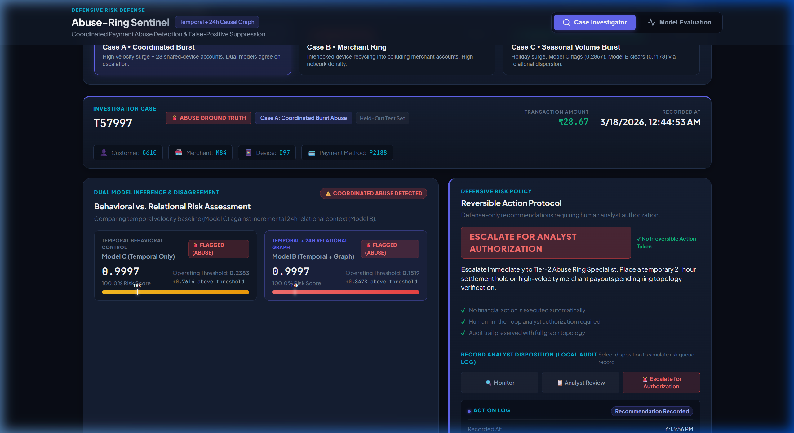
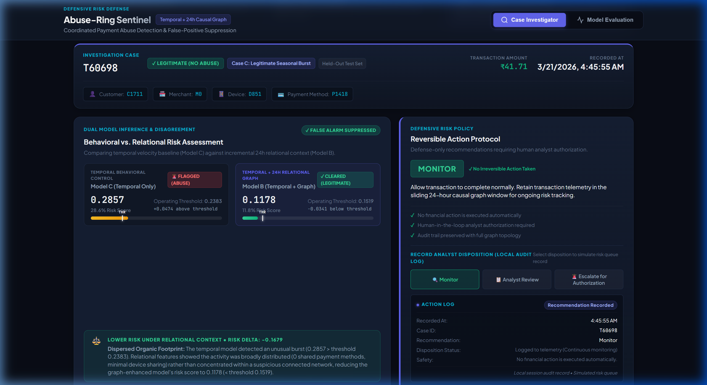
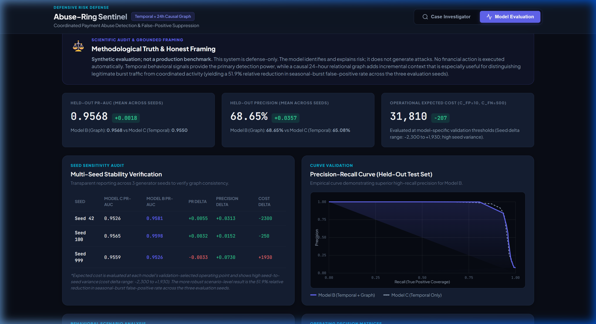

# Abuse-Ring Sentinel: Temporal Behavioral Risk Detector with Causal 24-Hour Relational Graph

> **Track**: Razorpay AI Risk Manager  
> **Repository**: [https://github.com/Dr-Dre420/abuse-ring-sentinel](https://github.com/Dr-Dre420/abuse-ring-sentinel)  
> **Methodology Status**: Frozen & Scientifically Audited (P0 – P1.7 Complete)  
> **Evaluation Nature**: Synthetic Evaluation; Not a Production Benchmark.  
> **Safety Notice**: Defense-only risk intelligence. All defensive recommendations require human analyst authorization. No financial action is executed automatically.

---

## Demo

### Coordinated Abuse Investigation (Case A)


### Temporal vs. Relational Context (Case C Disagreement)


### Model Evaluation Dashboard


---

## 1. Project Summary & Thesis
**Abuse-Ring Sentinel** is a defense-only payment risk detection system engineered to uncover coordinated abuse without imposing destructive friction on legitimate merchant burst volume. 

**Core Hypothesis & Technical Finding**:
- **Temporal behavioral signals provide the primary detection power** (~81% feature importance from 1-hour merchant velocity).
- A **causal 24-hour relational graph adds incremental context that is particularly useful for distinguishing legitimate burst traffic from coordinated activity** in our synthetic evaluation — achieving a **51.9% relative reduction in seasonal-burst false-positive rate across the three evaluation seeds** (29.17% in Model C down to 14.03% in Model B).
- The system operates strictly defense-only; all outputs are reversible recommendations requiring human analyst authorization before any financial action is taken.

---

## 2. Problem Definition
Transaction-by-transaction tabular fraud models evaluate payment requests in isolation or through single-account historical aggregations. This paradigm creates two acute failure modes in modern payment infrastructure:
1. **Blindness to Coordinated Distributed Attacks**: Fraud syndicates systematically distribute small-ticket charges across dozens of synthetic customer accounts and recycled virtual devices, keeping single-account velocity deceptively low.
2. **Flash Sale False Positive Spikes**: During high-velocity promotional events or seasonal sales (e.g., festive flash sales), organic buyer velocity mimics abusive velocity spikes. Unaugmented tabular models frequently trip velocity filters, triggering costly false declines ($C_{FP}$) that damage merchant trust and revenue.

Abuse-Ring Sentinel solves this tradeoff: temporal velocity detects the surge, while lightweight relational graph context determines whether the surge is organic (dispersed, natural customer network) or collusive (interlocked, shared infrastructure).

---

## 3. Architecture

```
                              Live Transaction Request [t]
                                          │
                  ┌───────────────────────┴───────────────────────┐
                  ▼                                               ▼
     Temporal Behavioral Engine                     Causal 24h Relational Graph
   (Rolling 5m, 1h, Expanding Medians)              (Sliding Window [t - 24h, t])
   ──────────────────────────────────             ──────────────────────────────────
   • txn_count_5m, txn_count_1h                   • customer_degree_24h (Strictly Prior)
   • burst_score, time_since_last_txn             • shared_device_customers_24h
   • merchant_velocity_1h (Dominant Signal)       • shared_pm_customers_24h
   • amount_ratio_vs_customer                     • two_hop_customer_count_24h
                                                  • local_cluster_density_24h
                  │                                               │
                  └───────────────────────┬───────────────────────┘
                                          ▼
                         Fused Feature Vector (13 Features)
                                          │
                                          ▼
                         XGBoost Graph-Enhanced Model (B)
                                          │
                        ┌─────────────────┴─────────────────┐
                        ▼                                   ▼
             Model Probability vs Threshold       Deterministic Explainability Engine
             (Validation-Frozen Threshold)       (Zero Hallucination Rule Attribution)
                        │                                   │
                        └─────────────────┬─────────────────┘
                                          ▼
                           Reversible Defensive Action
                    ┌─────────────────────┬─────────────────────┐
                    ▼                     ▼                     ▼
             [ MONITOR ]          [ ANALYST REVIEW ]      [ ESCALATE FOR ANALYST AUTHORIZATION ]
          (Organic Baseline)     (Step-up 2FA/3DS Queue)  (Human Review; Settlement Hold Rec)
                                                                 │
                                          ┌──────────────────────┴──────────────────────┐
                                          ▼                                             ▼
                          [ Human Analyst Authorized ]                    [ No Auto-Financial Action ]
```

---

## 4. Synthetic Data Generation & Disclosure
To test network hypotheses under controlled conditions, a multi-scenario synthetic dataset generator was implemented in `src/data.py`:
- **Total Transactions**: 69,270 transactions over 90 days.
- **Entity Pools**: 2,000 customers, 100 merchants, 1,000 devices, 2,500 payment methods.
- **Class Balance**: 95.28% legitimate (66,000 txns), 4.72% abusive (3,270 txns).
- **Hardened Scenarios (P1.6 & P1.7 Audit)**:
  - `coordinated_burst`: Abusive burst targeting merchants via shared infrastructure (Device pool: 15, PM pool: 50).
  - `merchant_ring`: Collusive merchant ring with synthetic buyers (Device pool: 30, PM pool: 80).
  - `seasonal_burst`: Legitimate flash sale with natural overlap (Customer pool: 300, Device pool: 200, PM pool: 250).
  - `background`: Ambient organic transaction stream.
- **Time-Aware Split**: Strict chronological split without shuffle:
  - **Train**: 60% (39,756 transactions)
  - **Validation**: 20% (14,713 transactions)
  - **Held-Out Test**: 20% (14,801 transactions)

> **Synthetic Evaluation Disclosure**: This project is a synthetic evaluation, not a production benchmark. The generator was hardened after discovering artificial device/PM sharing artifacts during audit. In production environments, real-world traffic contains missing attributes, network obfuscation, residential proxy rotations, and behavioural noise not present in synthetic generation.

---

## 5. Temporal Leakage Controls
A primary finding of the P1.7 audit was resolving a zero-second lookahead bug in the incremental feature extractor:
- **Pre-Event Feature Computation**: For any transaction at timestamp $t$, graph features are computed from the historical graph state **before** the transaction's edges are committed to the graph. This guarantees that customer degree and local density are purely historical pre-event properties.
- **Incremental Sliding Window**: Transactions outside $[t - 24\text{h}, t]$ are evicted from the active `networkx` graph using a streaming FIFO queue (`collections.deque`).
- **Timestamp Tie-Breaker**: Simultaneous transactions at identical second timestamps are ordered deterministically by arrival order, simulating a real-time event-streaming message bus.
- **Zero Future Contamination**: Rolling state does not leak from test to train. Dedicated temporal regression tests in `tests/test_graph.py` confirm zero temporal leakage across streaming sliding windows and tie-breaking.

---

## 6. Graph Methodology & Features
The causal graph is modeled as a multi-entity bipartite network $G = (V, E)$ where $V = C \cup M \cup D \cup P$ (Customers, Merchants, Devices, Payment Methods) and $E = \{(c, m), (c, d), (c, p)\}$ represent transaction events.

Five causal graph features are extracted for each event:
1. `customer_degree_24h`: Count of distinct entities connected to the customer in the past 24h.
2. `shared_device_customers_24h`: Count of distinct *other* customer accounts that operated on the transaction's device within 24h.
3. `shared_pm_customers_24h`: Count of distinct *other* customer accounts that transacted with the transaction's payment credential within 24h.
4. `two_hop_customer_count_24h`: Number of other customers reachable in exactly 2 bipartite hops (C → {D, P, M} → C′).
5. `local_cluster_density_24h`: Bipartite edge density between the customer's 2-hop customer neighborhood (C_set = {c} ∪ C_2hop) and associated entities (E_set). Formally: `density = actual_edges / (|C_set| × |E_set|)`.
   - **Why correlation with abuse is negative (-0.1614)**: In legitimate seasonal bursts and ambient traffic, organic shoppers interact across popular merchants and common devices/platforms, creating a dense bipartite mesh of natural cross-links. Conversely, synthetic abuse bursts connect narrow merchant targets with synthetic accounts whose bipartite neighborhoods have high potential pairings but low mutual cross-links.
   - **Why higher density should NOT automatically indicate higher risk**: Dense bipartite connectivity frequently reflects benign merchant popularity and natural customer overlap across common checkout channels, rather than collusive ring activity.

---

## 7. Model Methodology & Experiment Ladder
To establish rigorous benchmark floors and isolate incremental signal value, the investigation evaluates a four-tier **Experiment Ladder**:

```
                       ┌──────────────────────────────────────────────────┐
                       │  Model 0: Naive Single-Signal Heuristic          │
                       │  (Non-ML rule: merchant_velocity_1h >= 2.0)      │
                       └─────────────────────────┬────────────────────────┘
                                                 ▼
                       ┌──────────────────────────────────────────────────┐
                       │  Model A: Logistic Regression Baseline Floor     │
                       │  (Linear statistical baseline on temporal space) │
                       └─────────────────────────┬────────────────────────┘
                                                 ▼
                       ┌──────────────────────────────────────────────────┐
                       │  Model C: XGBoost Temporal Control               │
                       │  (Non-linear gradient boosted tree benchmark)    │
                       └─────────────────────────┬────────────────────────┘
                                                 ▼
                       ┌──────────────────────────────────────────────────┐
                       │  Model B: XGBoost Temporal + 24h Relational Graph│
                       │  (Full proposed graph-augmented model)           │
                       └──────────────────────────────────────────────────┘
```

### Role of Each Model
1. **Model 0 (Naive Single-Signal Heuristic Floor)**: Flag if `merchant_velocity_1h >= 2.0` (threshold derived deterministically on validation to minimize expected cost under $\text{Recall} \ge 0.80$), providing a transparent non-ML operational floor.
2. **Model A (P0 Interpretable Linear Baseline Floor)**: Logistic Regression with `class_weight='balanced'` on temporal behavioral features, measuring whether non-linear modeling is required.
3. **Model C (P1.5 Controlled Temporal Baseline)**: XGBoost (`max_depth=4`, `learning_rate=0.1`, `scale_pos_weight` tuned on train) trained exclusively on temporal behavioral features, serving as the fair baseline control.
4. **Model B (P1/P1.7 Proposed Graph-Enhanced Model)**: XGBoost sharing identical hyperparameters and temporal features as Model C, augmented with 5 causal 24-hour relational graph features to isolate the incremental value of network context.

> **Controlled Graph Experiment**: The controlled graph comparison is **XGBoost temporal-only (Model C) vs. XGBoost temporal + graph (Model B)**. Both share the exact same model family, tree depth, learning rate, and temporal feature space. Model 0 and Model A provide non-ML and linear reference floors; they are not part of the isolated graph contribution experiment.

All decision thresholds are selected **strictly on the validation set** to minimize expected financial cost under the operational constraint $\text{Recall} \ge 0.80$, then frozen for evaluation on the held-out test set.

---

## 8. Final Model Comparison

### Baseline Floors (Model 0 & Model A)
- **Model 0 — Naive Single-Signal Heuristic (`merchant_velocity_1h >= 2.0`)** (Held-Out Test Set):
  - Validation Cost: `29,990` | Validation Recall: `96.33%` | Frozen Validation Threshold: `2.0`
  - Held-out PR-AUC: `0.9460` (continuous `merchant_velocity_1h` ranking)
  - Held-out Precision: `53.34%` (0.5334)
  - Held-out Recall: `96.06%` (0.9606)
  - Held-out F1 Score: `0.6859`
  - Held-out FPR: `6.68%` (0.0668)
  - Expected Cost: `30,660`
  - Confusion Matrix: `TN=12,795, FP=916, FN=43, TP=1,047`
  - *Artifact*: `artifacts/evaluation/model_0_metrics.json`
- **Model A — Logistic Regression + temporal features** (Held-Out Test Set, Seed 42):
  - Validation PR-AUC: `0.9495` | Frozen Validation Threshold: `0.2407`
  - Held-out PR-AUC: `0.9587`
  - Held-out Precision: `48.35%` (0.4835)
  - Held-out Recall: `96.88%` (0.9688)
  - Held-out F1 Score: `0.6451`
  - Held-out FPR: `8.22%` (0.0822)
  - Expected Cost: `28,280`
  - Confusion Matrix: `TN=12,583, FP=1,128, FN=34, TP=1,056`
  - *Artifact*: `artifacts/evaluation/baseline_metrics.json`

### Controlled Evaluation: Model C vs. Model B (3-Seed Mean)
Across the 3-seed evaluation audit on the held-out test set (14,801 samples):

| Evaluation Metric | Model 0 (Naive Heuristic Floor) | Model A (LR Baseline Floor) | Model C (XGBoost Temporal Control) | Model B (XGBoost Temporal + Graph) | Delta (C $\to$ B) | Operational Implication |
| :--- | :---: | :---: | :---: | :---: | :---: | :--- |
| **PR-AUC (Mean)** | 0.9460* | 0.9587* | **0.9550** | **0.9568** | **+0.0018 (Mean)** | Incremental ranking improvement (2 of 3 seeds positive) |
| **Precision (Mean)** | 53.34%* | 48.35%* | **65.08%** | **68.65%** | **+3.57% (Mean)** | Higher precision on flagged accounts |
| **Recall (Mean)** | 96.06%* | 96.88%* | **95.32%** | **95.15%** | **-0.17% (Mean)** | Comparable high coverage on abuse |
| **F1 Score (Mean)** | 0.6859* | 0.6451* | **0.7731** | **0.7972** | **+0.0241 (Mean)** | Harmonic precision/recall balance |
| **FPR (Mean)** | 6.68%* | 8.22%* | **6.47%** | **5.59%** | **-0.88% (Mean)** | Overall suppression of false positive noise |
| **Expected Cost** | 30,660* | 28,280* | **32,017** | **31,810** | **-207 (Mean)** | High seed variance (range: -2,300 to +1,930) |

*\*Model 0 and Model A values reflect deterministic single-seed baseline floors on the held-out test set.*

> **Disclosure on Operational Cost**: Expected cost is evaluated at each model's validation-selected operating point and shows high seed-to-seed variance (cost delta range: -2,300 to +1,930). The -207 mean cost delta is not a robust standalone headline; the more robust scenario-level result is the 51.9% relative reduction in seasonal-burst false-positive rate.

---

## 9. Seed Sensitivity Analysis
To confirm results are not artifacts of a single favorable random seed, the identical data generation, feature extraction, and model training pipeline was executed across three distinct random seeds:

| Seed | Model C PR-AUC | Model B PR-AUC | PR-AUC Delta | Precision Delta | Expected Cost Delta |
| :---: | :---: | :---: | :---: | :---: | :---: |
| **Seed 42** | 0.9526 | 0.9581 | **+0.0055** | **+0.0313** | **-2,300** |
| **Seed 100** | 0.9565 | 0.9598 | **+0.0032** | **+0.0152** | **-250** |
| **Seed 999** | 0.9559 | 0.9526 | **-0.0033** | **+0.0730** | **+1,930** |
| **Mean** | **0.9550** | **0.9568** | **+0.0018** | **+0.0357** | **-207** |

> **Seed-Variance Disclosure**: Expected cost is evaluated at each model's validation-selected operating point and shows high seed-to-seed variance (cost delta range: -2,300 to +1,930). The strongest repeatable scenario-level result is the reduction in seasonal-burst false-positive rate.
> 
> *Scientific Integrity Note*: Seed 999 demonstrates transparent reporting. In Seed 999, graph PR-AUC experienced a minor dip (-0.0033) and expected cost increased (+1,930), while precision gained +7.30%. On aggregate, graph integration delivers positive directional stability, with seasonal-burst false-positive reduction consistent across all 3 seeds.

---

## 10. False-Positive Cost & Scenario Breakdown
Cost model assumption: $C_{FP}$ = \$10 (analyst verification & merchant friction), $C_{FN}$ = \$500 (chargeback loss and merchant fraud liability).

Analyzing scenario-level behavior reveals where the graph delivers decisive value:
- **Seasonal Burst (`seasonal_burst`)**:
  - **Model C (Temporal)**: 29.17% False Positive Rate (291.7 false declines per 1,000 transactions)
  - **Model B (Graph)**: **14.03% False Positive Rate** (140.3 false declines per 1,000 transactions)
  - **Impact**: **51.9% relative reduction in seasonal-burst false-positive rate across the three evaluation seeds**.
- **Ambient Traffic (`background`)**:
  - Model C: 4.67% FPR vs Model B: 4.91% FPR (+0.24% marginal noise trade-off).
- **Abuse Ring Detection**:
  - Coordinated Burst Recall: 97.63% (Model B) vs 97.78% (Model C) (-0.15%).
  - Merchant Ring Recall: 94.11% (Model B) vs 94.32% (Model C) (-0.21%).

*Key Takeaway*: Temporal behavioral features already capture coordinated bursts effectively via velocity. The distinct, validated contribution of the relational graph is disambiguating legitimate flash sales from coordinated pooling, suppressing seasonal false alarms.

---

## 11. Known Limitations
1. **Dominance of Temporal Velocity**: `merchant_velocity_1h` accounts for **80.95%** of XGBoost feature importance. Graph features provide secondary, incremental stabilization (~7.6% combined importance), not the primary signal.
2. **Synthetic Data Boundaries**: Entity multiplexing is synthetic. Real-world fraud rings employ residential proxy rotation and stolen credentials that exhibit more dispersion than synthetic generators emulate. This is a synthetic evaluation, not a production benchmark.
3. **Operational Cost Variance**: Operational cost delta exhibits high variance across random seeds (-2,300 to +1,930). Cost savings should be viewed as indicative rather than guaranteed.
4. **Graph Window Memory**: The 24-hour sliding window is computationally lightweight but does not capture long-horizon dormant collusion rings operating over weeks.
5. **Defense-Only & Human-in-the-Loop**: The system is defense-only. It produces risk explanations and recommendations; no financial action is executed automatically.

---

## 12. Setup & Reproduction Commands

### Environment Requirements
- **Tested & Verified Runtime Environment**: **Python 3.14.7** on Windows.
- Compatibility with older Python versions (3.10–3.13) has not been verified in this audit cycle.

```bash
# 1. Clone repository
git clone https://github.com/Dr-Dre420/abuse-ring-sentinel.git
cd abuse-ring-sentinel

# 2. Create virtual environment and activate
python -m venv venv
.\venv\Scripts\activate      # Windows
# source venv/bin/activate   # Linux/macOS

# 3. Install dependencies
pip install -r requirements.txt

# 4. Run automated test suite (20 tests passing)
pytest
```

---

## 13. Dashboard Launch Command
Launch the high-performance unified FastAPI dashboard server:

```bash
python -m uvicorn src.api:app --host 127.0.0.1 --port 8000 --reload
```

Open your browser and navigate to:
```
http://localhost:8000
```

---

## 14. API Launch & Usage Examples

### 1. Health Check
```bash
curl http://localhost:8000/health
```
*Response*:
```json
{
  "status": "healthy",
  "service": "abuse-ring-sentinel",
  "version": "1.0.0",
  "methodology": "frozen_p1_7",
  "models": {"model_B": "XGBoost + Temporal + Graph", "model_C": "XGBoost + Temporal Only"}
}
```

### 2. Case Investigation Lookup
```bash
curl http://localhost:8000/case/T57997
```

### 3. Model Evaluation Payload
```bash
curl http://localhost:8000/evaluate
```

### 4. Batch Scoring
```bash
curl -X POST http://localhost:8000/score/batch \
  -H "Content-Type: application/json" \
  -d '{"transactions": [{"txn_id": "TXN_001", "merchant_velocity_1h": 22.0, "shared_device_customers_24h": 8.0, "burst_score": 0.20}]}'
```

---

## 15. Five-Minute Demo Walkthrough

### 0:00 – 0:30: The Core Problem
- **Pitch**: Fraud rings exploit single-transaction blindness by distributing activity across synthetic customer accounts, while legitimate flash sales trigger catastrophic false positives in temporal-only risk engines.

### 0:30 – 1:15: The System Architecture
- **Concept**: Abuse-Ring Sentinel pairs high-velocity temporal behavioral modeling with a streaming 24h causal bipartite graph (Customers $\leftrightarrow$ Devices, Payment Credentials, Merchants).

### 1:15 – 2:30: Case Investigator — Coordinated Abuse Ring (Case A)
- **Action**: In the dashboard, click **Case A • Coordinated Burst (T57997)**.
- **Demonstration**:
  - **Case Context Strip**: Shows transaction telemetry, ₹1,240.00 amount, and entity chips (Customer C610, Merchant M84, Device D97, Payment Method P812).
  - **Dual Model Inference**: Both models agree on high risk — Model C score is **1.0000** (Threshold: 0.2383) and Model B score is **1.0000** (Threshold: 0.1519).
  - **Relational Context Impact**: Confirms *Coordinated Abuse Indicated (High Confidence)* based on interlocked multi-account device multiplexing.
  - **Split Evidence**: Highlights **Critical Merchant Surge** (52 txns/hr vs < 5 baseline) alongside **Severe Device Multiplexing** (28 accounts on 1 device).
  - **Static Investigation Timeline**: Traces the 24-hour pre-event trajectory from $T - 24\text{h}$ baseline through $T - 1\text{h}$ surge to $T0$ evaluation.
  - **Interactive Canvas**: Renders the causal ego-network with shared devices and payment instruments highlighted in red, with spring physics settling cleanly to rest.
  - **Defensive Policy**: Policy triggers **ESCALATE FOR ANALYST AUTHORIZATION** (routes to human Tier-2 specialist; no financial action is executed automatically).
  - **Action Log**: Click *Escalate for Authorization* — Action Log records disposition as *Awaiting human authorization* in the local session audit trail.

### 2:30 – 3:15: Case Investigator — Legitimate Flash Sale (Case C)
- **Action**: Switch to **Case C • Seasonal Volume Burst (T60698)**.
- **The "Aha!" Moment (Model Disagreement)**:
  - **Temporal Control Flagged**: Model C (Temporal-Only) tripped its velocity filter and falsely flagged this transaction (**0.2857** > operating threshold 0.2383) due to high holiday merchant velocity.
  - **Relational Context Cleared**: Model B incorporated 24-hour relational topology: the customer had **0 shared devices, 0 shared payment methods, and 1 isolated merchant connection**, suppressing the risk score to **0.1178** (< operating threshold 0.1519).
  - **Relational Context Impact Callout**: Prominently highlights *Lower Risk Under Relational Context (Score Delta: -0.1679)*, explaining the dispersed organic footprint.
  - **Defensive Policy**: Policy recommends **MONITOR**, preventing merchant churn and eliminating user friction.
  - **Action Log**: Click *Monitor* in the Analyst Recommendation Queue — Action Log updates to *Logged to telemetry (Continuous monitoring)* with zero financial impact executed automatically.

### 3:15 – 4:15: Model Evaluation View
- **Action**: Click the **Model Evaluation** tab.
- **Demonstration**:
  - Show the multi-seed PR-AUC mean improvement (+0.0018) and precision improvement (+3.57%).
  - Highlight the **51.9% relative reduction in seasonal-burst false-positive rate across the three evaluation seeds (29.17% $\to$ 14.03%)**.
  - Review Seed Sensitivity table (Seeds 42, 100, 999) with transparent disclosure of seed cost variance (-2,300 to +1,930) and Seed 999 PR-AUC dip (-0.0033).
  - Review the PR curve and confusion matrices.

### 4:15 – 5:00: Engineering Rigor & Judge Defense
- **Summary**:
  - Explain why temporal features dominate (~81% importance) and why claiming "graph-centric" would be dishonest.
  - Explain how the zero-second lookahead bug was identified and resolved.
  - Emphasize that all defensive recommendations are strictly reversible with human-in-the-loop auditability.

---

## 16. Repository Structure
```
abuse-ring-sentinel/
├── README.md                      # Comprehensive submission documentation
├── LICENSE                        # MIT License
├── .env.example                   # Environment configuration template
├── .gitignore                     # Git hygiene rules
├── requirements.txt               # Pinned Python package dependencies
├── src/
│   ├── api.py                     # FastAPI service & evaluation endpoints
│   ├── cases.py                   # Case telemetry, timeline & explanation logic
│   ├── data.py                    # Multi-scenario synthetic transaction generator
│   ├── features.py                # Causal 24h bipartite graph feature extractor
│   ├── evaluate.py                # Multi-seed audit & evaluation suite
│   ├── model_0.py                 # Naive single-signal heuristic baseline evaluation
│   ├── train.py                   # Model training & threshold selection
│   └── static/
│       ├── index.html             # Risk Operations Console
│       ├── styles.css             # Dark slate visual design system
│       └── app.js                 # Interactive dashboard logic & settling canvas
├── tests/
│   ├── test_graph.py              # Zero-leakage temporal regression tests
│   ├── test_model_0.py            # Model 0 deterministic validation & test assertions
│   ├── test_p2_dashboard_api.py   # API contracts, Case C values & safety tests
│   └── test_smoke.py              # Core endpoint smoke tests
└── assets/
    └── screenshots/               # Dashboard screenshots for public repository
        ├── case_a_investigation.png
        ├── case_c_disagreement.png
        └── model_evaluation.png
```
